# Local AI Advisor: engineering onboarding and initial correction

Audit date: October 10, 2026 (America/Chicago). Repository: `Himalpok1/local-ai-advisor`. Baseline commit: `22d27546ba5e0df2bd9be1ff3df24857539db651`. Review branch: `fix/hf-chat-eligibility`.

## Outcome and boundaries

The project directory was empty. Cloned the requested existing repository into it; `main` was clean before creating the review branch. No replacement app, production writes, migrations, pushes, deployment, DNS, analytics changes, or account submissions occurred. The user's engineering assignment explicitly authorizes the engine/import correction; AGENTS.md's daily Ray restrictions do not prohibit this separately authorized task. AGENTS.md remains unchanged.

The specialized-model rating bug is confirmed both live and locally, and corrected at the shared import boundary. A second P0 bug in direct benchmark anchoring is confirmed and deliberately deferred to the next implementation decision. See [roadmap](roadmap.md) and [validation plan](validation-plan.md).

This is a systems audit and representative product walkthrough, not exhaustive line-by-line certification or an accessibility conformance claim. Main calculation, ingestion, persistence, API, page-generation and UI flows were inspected. All existing automated tests ran. Account/database behavior and actual inference speeds could not be exercised without dedicated credentials and representative machines.

## Architecture and data flow

Verified package versions: Next.js **16.3.8**, React **19.2.8**, TypeScript 5, Tailwind 4, Zod 4.6.5, Drizzle ORM 0.45.3, mysql2, NextAuth 5 beta, Vitest 5.0.3. No architectural rewrite is needed.

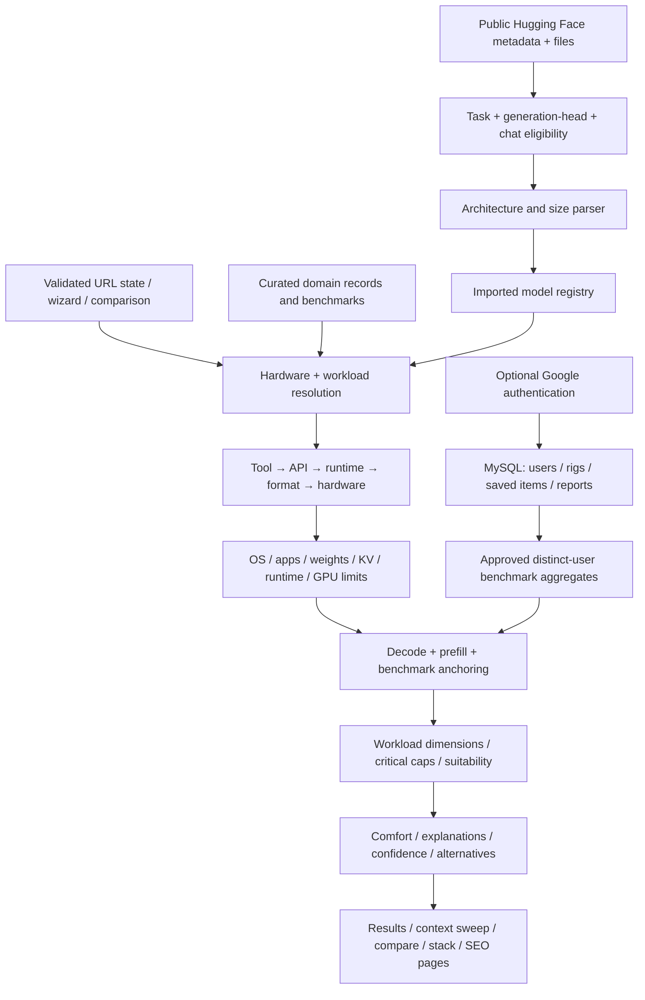

| Module | Responsibility / inspected entry points | Important constraint |
|---|---|---|
| `lib/schemas/index.ts`, `results.ts` | Zod entities and input constraints; plain engine output types | Capability tiers are editorial or inferred, not measured quality scores |
| `data/` | Models, hardware, quants, tools, APIs, runtimes, downloads, benchmarks | Sources and verification dates attached to entities |
| `lib/share.ts`, `workloads/` | Validated queries, custom hardware, workload thresholds, repository/context/concurrency assumptions | Defaults affect recommendations materially |
| `lib/compatibility/index.ts` | OS/backend selection, formats, quant availability, tool API paths | Architecture-specific runtime implementation support is not fully represented |
| `lib/memory/index.ts` | Weights; full/sliding/MLA KV; OS/dev/tool reserves; unified caps and discrete spills | Estimates include heuristics for overhead, compression and vision |
| `lib/performance/index.ts` | Bandwidth-bound decode, compute-bound prefill, context latency, calibration, streams | Direct anchors and heuristic error bands need stronger validation |
| `lib/recommendations/{evaluate,scoring,search}.ts` | Nine dimensions, weighted score, critical caps, confidence, best quants, hardware search, context sweep, what-if, cross-workload fit | Selection prioritizes usability; lowest quant is reserved for cases needing it |
| `lib/hf/{fetch,parse,eligibility,new-models,summary,client}.ts` | Server-only Hub access, metadata/file caches, guarded conversion to engine schema; client registration | All normal imported-model ratings pass through the guarded parser |
| `app/`, `components/advisor/`, `components/explore/` | Server pages decode inputs; client wizards, results, comparisons and catalogs use the shared engine | Preserve route/query compatibility and current visual identity |
| `auth.ts`, `lib/db/`, `lib/me/`, `lib/community/` | Lazy MySQL pool, Google sign-in, JWT session, owned saved items, moderated community speeds | Actions check authentication/ownership; integration testing needs isolated DB |
| `lib/blog.ts`, `components/learn/`, sitemap/metadata pages | Validated MDX, ten lessons and interactive widgets, RSS, JSON-LD and programmatic pages | SEO output is engine-derived, but indexing quality needs real crawl data |
| `.github/workflows/model-refresh.yml`, scripts and `research/` | Weekly review reports and issues; factual data maintenance guidance | Refresh is review-only for curated entries; not executed in this audit |

Current counts from executable data exports: **41 selectable curated models, 126 hardware configurations, 76 benchmark rows, 9 runtimes, 15 tools, 10 lessons, 30 seeded HF share pages**. `ALL_MODELS` includes one additional reference-only model (42 total); it is not a selectable recommendation. Sitemap model × hardware combinations are **5,166**. The build pre-renders 779 featured pairs and generates remaining pairs on demand; it does not build all combinations up front.

External services: Hugging Face Hub for imports/discovery, Google OAuth for optional accounts, MySQL for persistence/community, Google Fonts at build time, Google Analytics/AdSense scripts from the existing layout, and public benchmark sources. No external settings were changed.

## Development environment and verification

`npm ci` installed 550 packages from the existing lockfile. No dependencies or lockfile changes. The npm policy reported blocked install scripts for esbuild, fsevents and unrs-resolver; no scripts were approved. npm audit reported five high-severity dependency entries in the ESLint development chain (`braces` → `micromatch` → `fast-glob` → Next ESLint packages). These are not five independent production vulnerabilities. A force-fix would propose a major downgrade; do not run it blindly.

The default `/Users/macstudio/.dsh/bin/node` cannot load the installed native bindings (macOS Team ID mismatch). Initial `npm test` failed during Rolldown startup; initial build failed loading Lightning CSS/SWC. Typecheck and lint passed. Using the already bundled Node runtime resolved the environment problem without source/package changes:

```sh
export PATH="/Users/macstudio/.cache/codex-runtimes/codex-primary-runtime/dependencies/node/bin:$PATH"
npm test
npm run typecheck
npm run lint
npm run build
```

This path is desktop-specific; normal supported Node on another machine should be used there. Baseline: **9 test files / 181 tests passed**, typecheck passed, lint passed, production webpack build passed (**1,065 static outputs**). After correction: **10 files / 202 tests passed**, typecheck/lint/build passed. Focused HF run: **79 tests passed**, including **21 new eligibility regression cases**. `git diff --check` passed. No pre-existing source compilation or test failure remained after runtime correction. The local browser also logged pre-existing `DATABASE_URL is not set` errors when optional auth/session or account requests ran: `auth.ts` constructs its Drizzle adapter during lazy auth configuration, and `currentUserId()` sits outside some API error catches. Core recommendations remained usable; optional services need configuration and graceful unavailable handling.

Commands included repository discovery/status/remote checks, `git clone`, branch creation, dependency installation, the four npm checks, focused Vitest runs, `npm audit --json`, code searches/reads, read-only curl/Hub/source/sitemap probes, and local `next start` on ports 3001/3002. No database commands ran. The README now documents optional account-service variables: `DATABASE_URL`, `AUTH_SECRET`, Google provider ID/secret, `AUTH_URL`, `ADMIN_EMAILS`; optional `HF_TOKEN` remains server-only. No secret values were printed or saved.

Node's unauthenticated Hub probes received HTTP 429 during local runtime verification; application endpoints appropriately returned 502 rather than inventing a rating. A successful build is not proof that every HF static page fetched successfully, because those pages have noindex/error fallbacks. Deterministic mocked Hub tests cover the correction. A separate temporary local server with captured public config responses verified actual rendered refusal and supported import behavior; its screenshots are explicitly labeled **fixture-backed**, not live Hugging Face results. Temporary mocks were outside the repository and are not application changes.

## Confirmed P0: specialized models rated as chat generators — fixed

Locations: `lib/hf/new-models.ts:113` (broad discovery), `:121` (reference-machine general-assistant ratings), `lib/hf/parse.ts:151` (new shared admission guard), `lib/hf/eligibility.ts`, `lib/hf/fetch.ts:149` (config resolution).

Observed production feed: `LiquidAI/d1-omni-600M` marked Excellent on the 24 GB GPU with **1,130–1,880 tok/s**. Local pre-change reproduction with the captured official config returned Excellent, Q6, about **1,257 tok/s**; file discovery/default details differ from live, but the same incorrect classification is reproduced. Its [official model card](https://huggingface.co/LiquidAI/d1-omni-600M) describes a decision model with no output-token generation. The outer architecture is `D1OmniModel`; a nested text backbone contains enough fields for the old parser to invent a generative model.

Expected: no conversational comfort or token-generation speed for decision/classification, embedding, reranking, encoder-only, specialized OCR/document parsing, diffusion, base, or unverified conversational models. General text assistants and supported generative vision-language models should continue through the existing engine.

Root cause: the feed's pipeline filter is only a discovery filter. The old parser refused a few embedding categories but inferred chat capabilities from size/name for anything with readable text layers. The same path powered manual API imports, share pages/OG cards, comparisons and saved/shareable HF setups.

Correction:

1. Pure shared eligibility classifier checks negative pipeline/library/type/head/task/file evidence first, including single-pass decision-head config fields. No repository-specific exclusion.
2. Requires evidence of an **outer** causal/conditional generation head (or a conservative GGUF family fallback), plus a repository chat template or explicit conversational/instruct metadata. A nested language trunk alone is insufficient.
3. Explicit base/pretrained names/tags cannot receive chat ratings, even if they carry a template. Missing evidence becomes **uncertain**, not a guessed recommendation.
4. The parser throws before model registration, capability assignment or engine evaluation. Server imports translate this into the existing helpful **422** contract. Feed cards display “Not rated”; RSS carries the explanation. HF share pages retain their existing noindex refusal handling; OG cards now distinguish ineligibility from temporary service failure.
5. Readable original configs are not silently replaced with a generative parent when they lack text layers. Architecture mirrors may supply dimensions, but a parent's tokenizer template no longer establishes a child's conversational tuning.
6. Feed explanatory copy states that only eligible models receive ratings. No memory/performance formula, curated catalog or working route was changed.

Tests: official d1 fixture; broad vision pipeline plus misleading template; embeddings/rerankers; encoders; classification heads; OCR/parsing; diffusion/image pipeline; base/reward/seq2seq; conflicting pipeline metadata; unknown heads/nested backbones; missing or malformed optional signals; supported dense/MoE/VLM fixtures; direct 422 API with no model/performance payload; feed engine-call absence; rendered feed with no speed/Excellent label; RSS explanation; parent-template and parent-config fallback regressions.

Limits: admission is conservative metadata classification, not proof of runtime support or model quality. False negatives are preferable to unsupported ratings; metadata-poor valid imports may now be refused. Convincingly mislabelled specialized models can still require explicit reviewed task evidence; the classifier does not semantically read every README. Base/specialized memory-only evaluations would need a separate product flow, not forced chat ratings. Existing deployed caches still show old behavior until this branch is reviewed and deployed through the normal process.

## Confirmed P0: direct benchmark anchoring cancels offload effects — deferred

Location: `lib/performance/index.ts:238`–240 in `estimatePerformance`. `benchCtx` retains the *requested* offload fraction. Dividing the benchmark speed by the raw estimate at that same fraction normalizes away the slowdown; the current prediction then multiplies by it again.

A clearly labeled **synthetic unit probe**, not a real measured/submitted benchmark, evaluated Qwen3-8B Q4 on RTX 4090 with a 100 tok/s anchor. At requested/actual offload fractions **1, 0.25, 0**, generation was **85.7583 tok/s in all three cases**, still marked measured. This demonstrates the calculation defect; it does not claim a real hardware speed.

User impact: direct-anchor cases can overstate speed and comfort for CPU/offloaded configurations. Expected: benchmark normalization uses the benchmark's original configuration; requested placement should retain the bandwidth penalty. Add direct-anchor tests across offload, context, cache type, runtime wrapper and battery changes. See roadmap P0-2; do not replace the whole engine.

## Additional findings and evidence limits

| ID / severity | Location and evidence | Behavior / root cause / impact | Expected solution and regression requirement |
|---|---|---|---|
| T1 / P1 trust | `lib/performance/index.ts:170`, `data/benchmarks.ts` | Direct match keys omit exact quant variant, context, batch, runtime version and placement. “Measured” can describe extrapolated outputs. Some source dates are broad ranges and one source notes summarizing-fetch transcription. | Store benchmark settings/provenance; display measured anchor separately from prediction; test mismatched variants and context/placement changes |
| T2 / P1 trust | `lib/format.ts:20` | Fixed ±15% calibrated / ±25% estimated ranges are heuristic, not validated intervals | Label assumption bands; build held-out error reporting by backend/model regime before claiming calibrated coverage |
| T3 / P1 compatibility | `lib/compatibility/index.ts:104`, `lib/hf/fetch.ts`, parser format assumptions | Format/API/backend compatibility and name-matched GGUF conversions do not establish architecture/version support or tensor equivalence | Reviewed runtime capability matrix and conversion provenance; no confident setup command for unverified architectures; fixture tests for unsupported versions |
| T4 / P1 price trust | `components/advisor/compare-hardware.tsx:42,83`; `lib/recommendations/search.ts:139`; `components/can-i-run/doesnt-fit.tsx:121` | Compare says Approx. price / Lowest price; some pages say cheapest. Figures are approximate launch system prices. Hardware catalog and purchasing wizard disclose this, but not every comparison/SEO result does | Show dated launch-price basis beside every price/budget ranking; unknown price must not imply within budget; test wording/order policies |
| T5 / P1 usability/accessibility | `components/ui/form.tsx:81`, `components/advisor/workload-form.tsx`; captures 03–06,10 | Single-choice cards appear as pressed checkboxes in AX; segmented controls declare radio roles but have no roving focus/arrow handling. Tiny progress/skip controls are touch risks | Use consistent single-choice semantics, keyboard arrow behavior, visible focus and adequate targets; manual keyboard + accessibility tests |
| T6 / P1 indexing | `app/layout.tsx:20`, sitemap, canonical page metadata; read-only HTTP | `www` home returns 200, not redirect; canonicals use non-www. `/games/pong` returns true 404. No Search Console access | Host-level www consolidation requires approval; retain relevant-page mappings only; no irrelevant homepage redirects; crawl/canonical checks |
| T7 / P2 exploration | Compare/result components; captures 07–09,11,16 | Existing gauges, memory visuals and lesson widgets help, but comparisons are mostly tables. Competitor adds richer chart exploration | Add one engine-powered context/latency chart first, with prediction/uncertainty labels and accessible table alternative |
| T8 / P2 feed robustness | `lib/hf/new-models.ts:113,143`, budgets/caches | Listing JSON is cast; invalid/future dates can pass release filtering. Time-budget Promise.race doesn't cancel ongoing import work. Process caches don't share across workers | Validate listing/date inputs, deterministic partial-source diagnostics, bounded/cancellable work; invalid metadata and timeout tests |
| T9 / P2 community | `lib/community/server.ts`, `reports.ts:143`, API/page | Production says No reports yet; DB errors have a distinct unavailable state. Latest distinct users, approval and three-person threshold protect calibration. Groups merge different contexts/settings | Do not invent submissions; expose verified published measurements separately; normalize/group settings before community calibration; isolated DB failure/ownership tests |
| T11 / P1 optional-service reliability | `auth.ts`, `lib/me/server.ts`, `app/api/me/rigs/route.ts` | Signed-out/session requests can fail before the route catch when DATABASE_URL is absent; comments overstate DB independence | Handle unconfigured optional auth gracefully; isolated absent-env/session failure tests without exposing credentials |
| T10 / P2 maintenance | npm audit output, `eslint-config-next` chain | Five high-severity development dependency entries, one advisory chain; baseline lint passes | Assess reachable build/lint risk and compatible patch; no forced major downgrade; full four-check validation |
| D1 / P2 documentation — fixed | README feature description; `app/tools/page.tsx:58` | Simple wizard is five steps, Advanced six. Tools description said four layers while enumerating five components | README now distinguishes modes; tools heading now says five components |

Memory sizing handles unified/discrete pools, reserves, GQA KV, sliding attention, MLA overrides and measured file-format provenance. Those are valuable strengths. Hybrid/recurrent state, sparse/compressed attention, vision overhead and partial offload remain approximations; no new calculation changes were justified solely by suspicion. Model capability tiers and size-derived imported suitability cannot be treated as independent intelligence benchmarks. Browser bandwidth testing measures a browser workload, not end-to-end inference throughput.

SEO: 5,166 combination pages contain engine-derived chat/coding/agent answers, memory gaps, alternatives and commands; they are more than name-only templates. Preserve them. Review a stratified crawl for near-duplicate outcomes and usefulness before reducing indexing. Canonicals, sitemap, internal links, breadcrumb/FAQ JSON-LD and HF noindex errors were inspected. No ranking claim or search-traffic conclusion is possible without Search Console. Existing Analytics/AdSense behavior was observed in code, left intact.

Community: production empty state verifies only no public qualifying aggregates, not zero DB submissions. Pending, rejected or one-user measurements cannot be inferred. Cold-start recommendation: organize consented real measurement sessions and display existing published benchmarks under their real sources; do not impersonate user activity.

## Validated competitive comparison

[Local Analysis home](https://localanalysis.ai/) and [open data](https://localanalysis.ai/open-data/) currently show 74 models, 194 devices, four locales, 14,356 model-device estimates and CC BY 4.0 reuse with attribution. Downloaded model/device JSON counts match. Its [methodology](https://localanalysis.ai/how-we-grade/) reports 193 measurements and held-out backend errors; those are publisher claims, not independently reproduced calibration results. Its live homepage visibly renders hardware detection and charts. Current sitemap-index crawl counted **2,468 URLs across 20 child sitemaps**, matching the prior crawl. Dataset/source license distinctions remain intact; no competitor data/assets/text were added to the app.

| Area | Local AI Advisor evidence | Competitive conclusion |
|---|---|---|
| Practical workload comfort | Shared engine models prompt ingestion, tool overhead, repository size, agent calls, reserves, concurrency and capability | Preserve as the main differentiator; competitor's public grade methodology focuses primarily on memory and generation speed |
| Stack compatibility | Tool/API/runtime/backend flow, commands, `/stack` | Stronger guidance breadth in inspected Advisor flows; do not substitute a generic speed grade |
| Discovery breadth | 41 models / 126 configurations versus 74 / 194 | Real gap; coverage quality and relevant user hardware matter more than matching totals |
| Visual exploration / export | Advisor gauges/widgets/tables; competitor charts and downloadable model/device estimates | Worth incremental charts and versioned exports with honest provenance |
| Localization | Advisor `<html lang="en">`; competitor EN/ES/FR/DE routes | Confirmed gap; translate only after terminology and data/trust policy stabilize |
| Live import and education | Server Hub import, native context, conversions, ten lessons | Valuable differentiators to protect; current specialized guard strengthens credibility |

Do not copy visual assets, text, implementation, a universal intelligence leaderboard, or bulk-add models solely to match competitor counts. If reusing licensed data later, review attribution to both Local Analysis and upstream contributors and retain measured-vs-predicted distinctions. Initial priority: correctness → validation/provenance → simpler task completion → exploration/catalog breadth.

## Product walkthrough and screenshot evidence

All images below were captured in this run through the Codex in-app browser, saved locally and visually inspected (overview plus full relevant captures). Desktop viewport was the existing browser size; mobile captures used 390×844 and the override was reset. These are representative top/selected table views, not full-page accessibility or every-route coverage.

| Step | Screen / image | Health / finding |
|---|---|---|
| 1 | [Live new-model feed](01-live-feed.png) | Broken correctness: green Excellent and impossible generation semantics for decision models |
| 2 | [Wizard hardware](02-wizard-hardware.png) | Works; named controls, memory choices and detection guidance; explicit default hardware needs user confirmation |
| 3 | [Wizard use](03-wizard-use.png) | Works; broad categorized workloads, many choices; initial agentic default is a product choice to revisit |
| 4 | [Wizard app](04-wizard-app.png) | Works; general-assistant selection suggested Open WebUI; lower rows visibly truncate some titles |
| 5 | [Wizard details](05-wizard-details.png) | Works; clear explicit memory reservations and Skip to results |
| 6 | [Wizard priority](06-wizard-priority.png) | Works; three understandable tradeoffs and clear final action |
| 7 | [Wizard results](07-wizard-results.png) | Works; best/fast/quality and confidence distinguish choices; table remains available |
| 8 | [Detailed evaluation desktop](08-evaluate-desktop.png) | Works; verdict, tiers, confidence, gauges and explanations accessible in AX |
| 9 | [Detailed evaluation mobile](09-evaluate-mobile.png) | Top section fits; stacked hero is tall so important details require scrolling; no top-level overflow observed |
| 10 | [Wizard hardware mobile](10-wizard-mobile.png) | Top section fits; sticky actions above mobile nav; card must scroll for lower fields; check small targets |
| 11 | [Competitor home](11-competitor-home.png) | Functional detection and chart-heavy exploration; useful inspiration, not a new design target |
| 12 | [Community](12-community.png) | Honest No reports yet state; source inspection distinguishes unavailable from empty |
| 13 | [Local unsupported import, public fixture](13-local-unsupported-fixture.png) | Fix verified: readable explanation, no model result or generation speed |
| 14 | [Local supported import, public fixture](14-local-supported-fixture.png) | Supported Qwen import still renders architecture facts and hardware/workload controls |
| 15 | [Hardware comparison controls](15-compare-hardware.png) | Works; established model/workload selection and columns preserved |
| 16 | [Hardware comparison table](16-compare-table.png) | Actual price trust gap: Approx. price and Lowest price lack adjacent launch-date/basis disclosure |

Visible strengths: approachable cream/yellow/mint palette, thick borders, consistent illustrations, clear selected cards, responsive stacking, persistent mobile navigation, text alongside comfort color. Global `:focus-visible` styles exist. Contrast was not numerically measured; full keyboard/screen-reader behavior, dark-mode contrast, mobile tables, loading states on all routes and touch-target measurements remain acceptance tasks. No redesign was performed.

## Changed files and handoff

- New `lib/hf/eligibility.ts`: pure conservative admission policy.
- `lib/hf/parse.ts`, `fetch.ts`: shared guard, honest 422 message, original config preservation and own-template provenance.
- `lib/hf/og.tsx`, `app/new-models/page.tsx`, `feed.xml/route.ts`: honest eligibility/absence presentation.
- `tests/hf-eligibility.test.ts`, official d1 config fixture: 21 new regression cases and presentation/API/feed assertions.
- Existing HF test helpers now declare explicit conversational evidence; numeric/KV/capability assertions remain intact.
- README and `/tools` clarify existing modes and five stack components; README adds safe development/environment guidance.
- This report, roadmap, validation plan and screenshots preserve reusable audit evidence. No temporary notes added to AGENTS.md.

Review the diff, especially conservative refusal policy for metadata-poor imports. Recommended next authorized implementation phase: **P0-2 direct benchmark anchoring**, with provenance/basis labeling next. Production credentials, hosting-level www redirects, dedicated inference measurements, external data reuse and deployment require their own decisions. No implementation of remaining roadmap items has begun.

## Captured screen gallery

These are the numbered evidence views above; local import captures 13 and 14 use public fixtures.

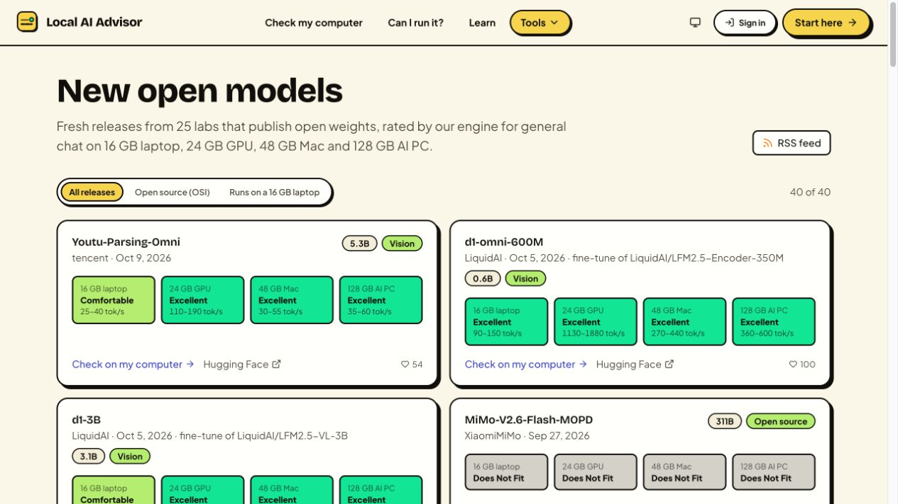

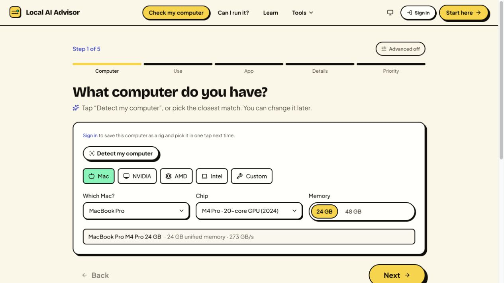

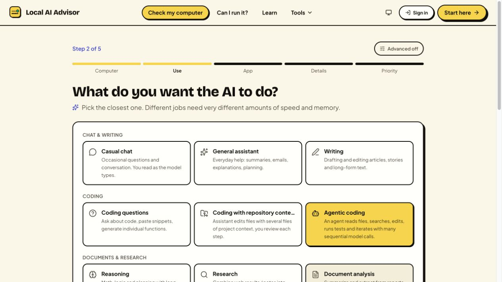

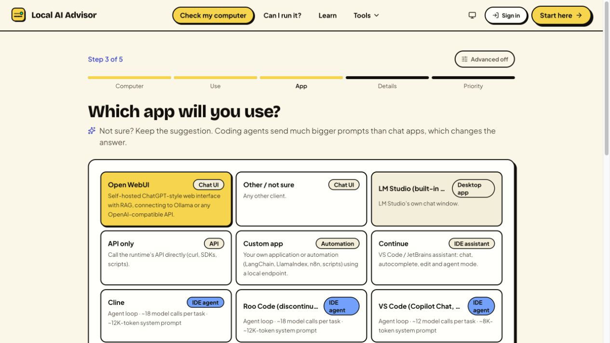

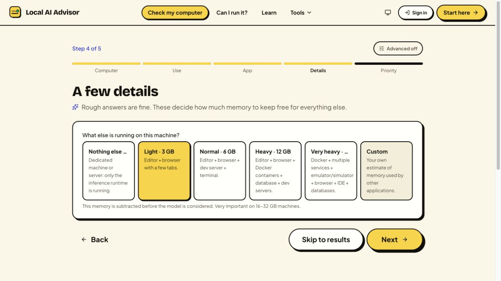

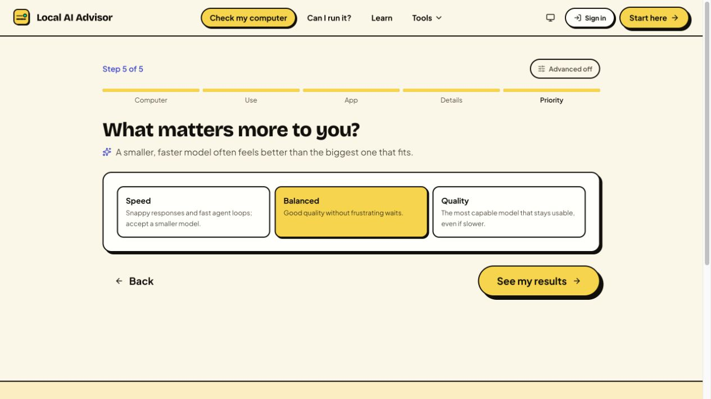

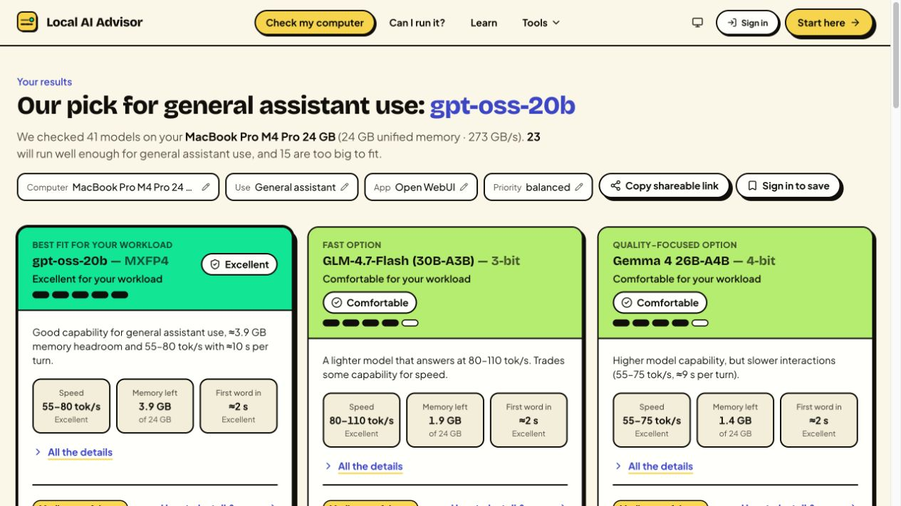

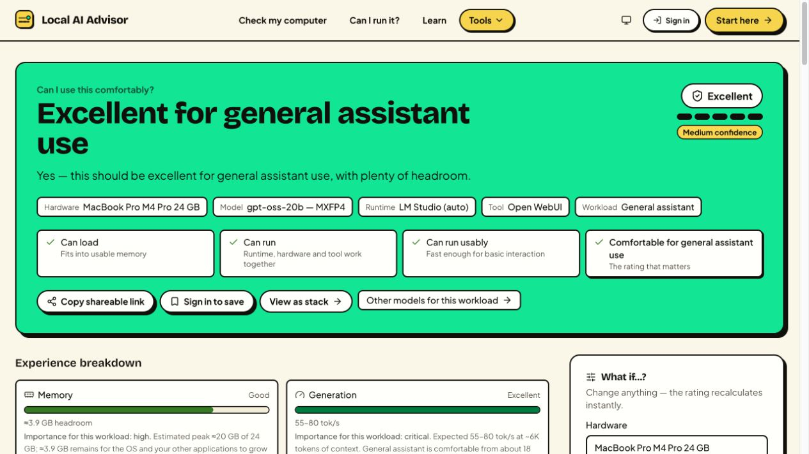

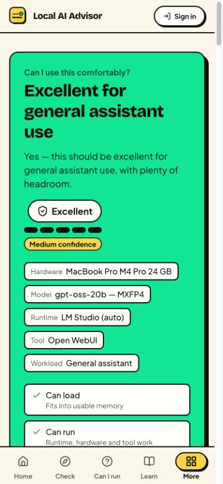

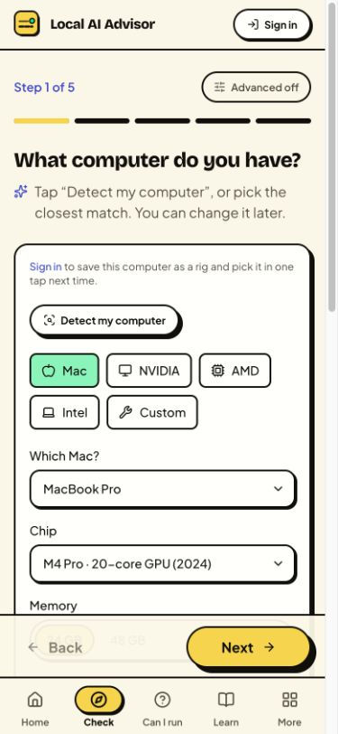

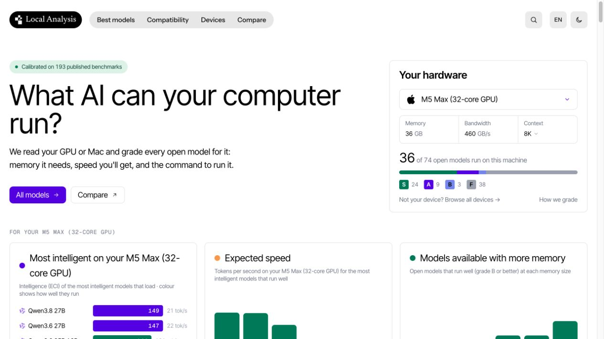

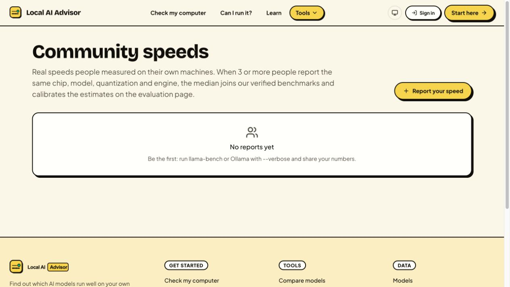

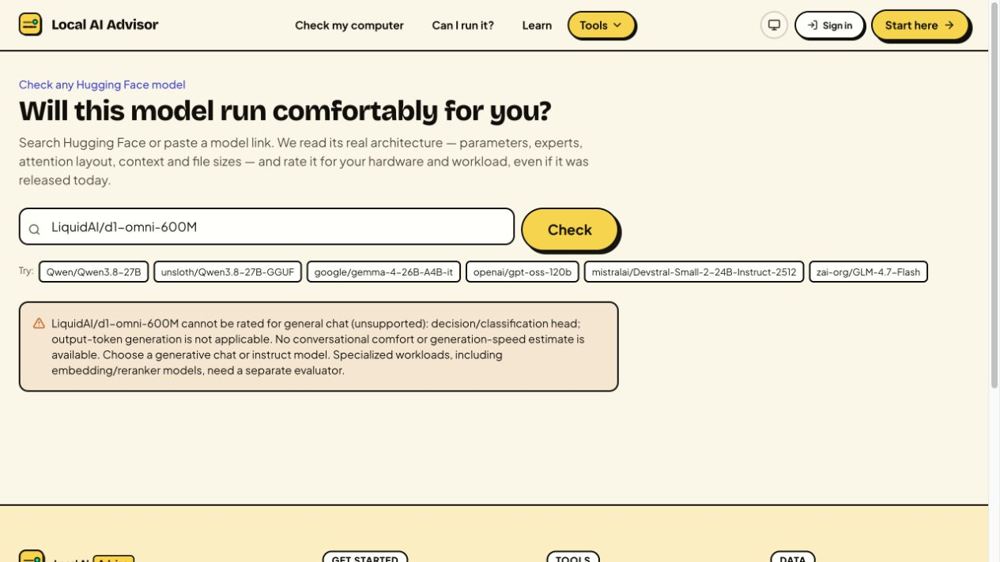

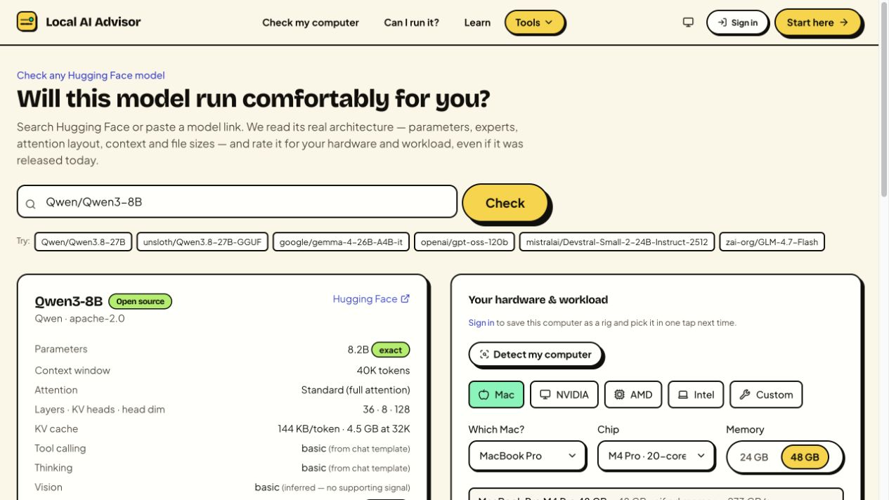

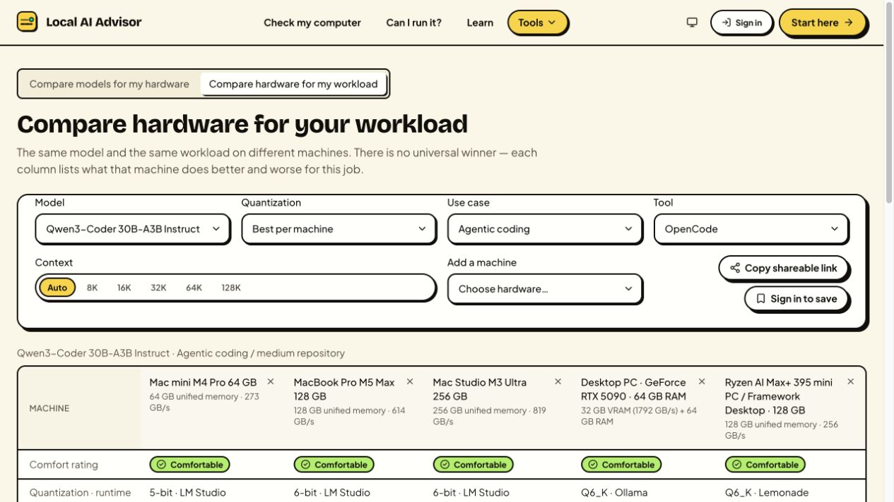

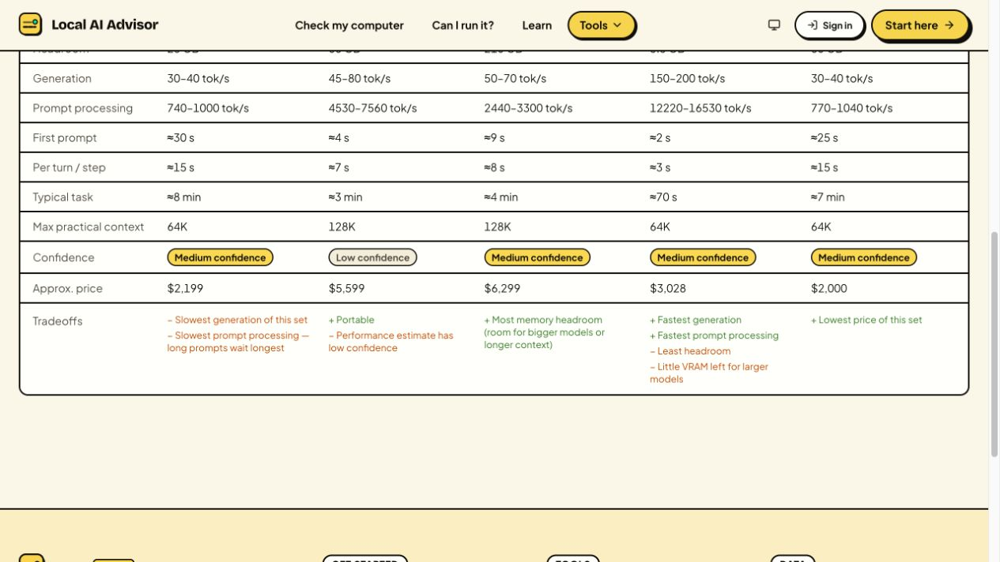

